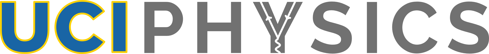
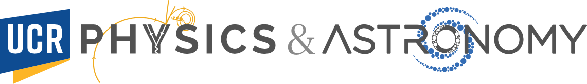
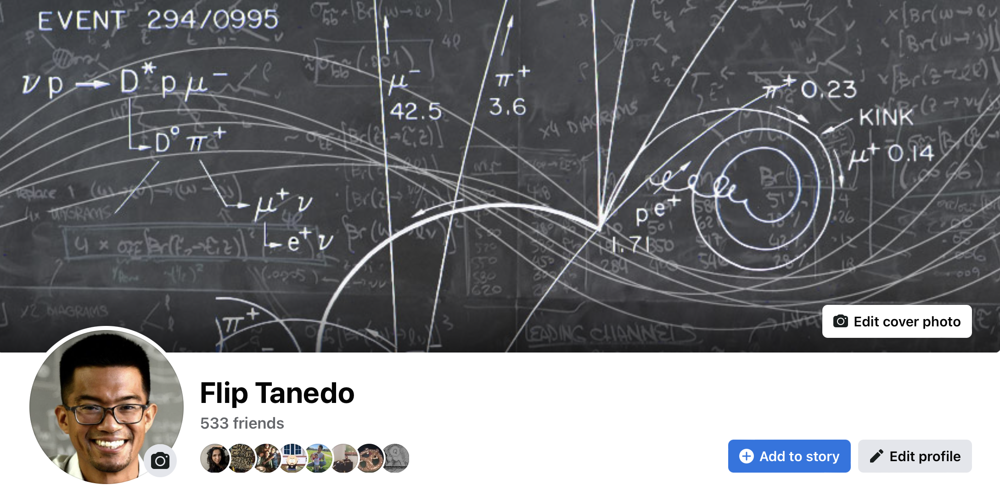
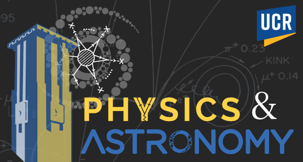
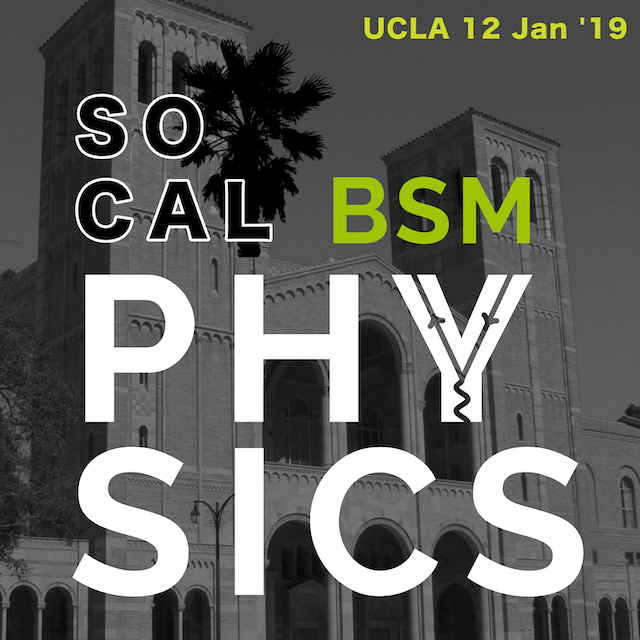
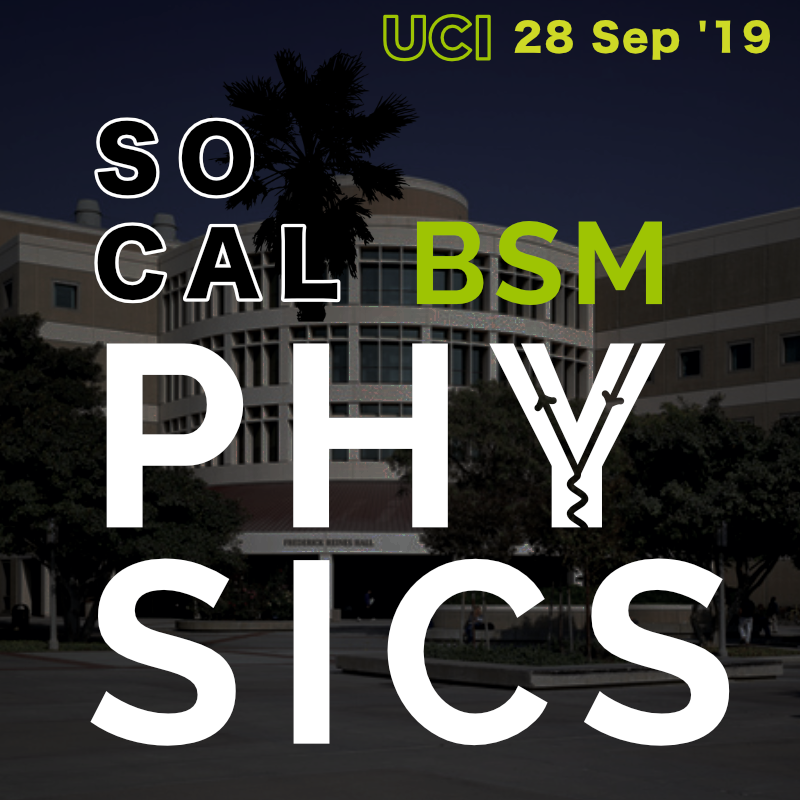

SoCal BSM was a workshop that I initiated for the Southern California particle phenomenology community. It was one of my goals after starting my job as an assistant professor at UC Riverside. I wanted to build on the existing connections with the UC Irvine particle theory group where I had just completed my postdoc, the group at UCLA, and the recent faculty at UCSB, UC San Diego, Harvey Mudd, and Caltech. 

The square logo follows the uniform width lines of a bold sans serif font---I believe I was using Helvetica or Helvetica Neue---which in turn was inspired by UC Irvine's recent rebranding. In fact, I had first played with the UCI rebranding by creating a logo for the particle physics group:

The `y` with a Feynman diagram would be my signature for a few years. It reappears in the UC Riverside physics department website (circa 2020):

The yellow bubble chamber flourishes on 'physics' come from traces of some of the public bubble chamber images available from Fermilab. I think I had vectorized them in the past for my Facebook banner:

The spiral galaxy flourish on 'astronomy' is not my design at all, but rather the excellent logo by Dr. Mario De Leo Winkler, who was a postdoctoral fellow with the UCR astronomy group. Both the font and stylized 'o' are part of his design, and I asked his permission to merge the two for a unified department brand:

The UCR clocktower is another graphic created by Mario that I adapted with his permission. The department had been using that logo for its internal communications to announce seminars. Variations of these logos appear on the [UCR Physics website](https://physics.ucr.edu) as of August 2022.

The first [SoCal BSM](../../archived/SoCalBSM2017) took place in 2017 hosted at UCR. We had follow up events in 2018 at UCLA and 2019 at UCI.

  

We stopped organizing these workshops due to COVID-19.
