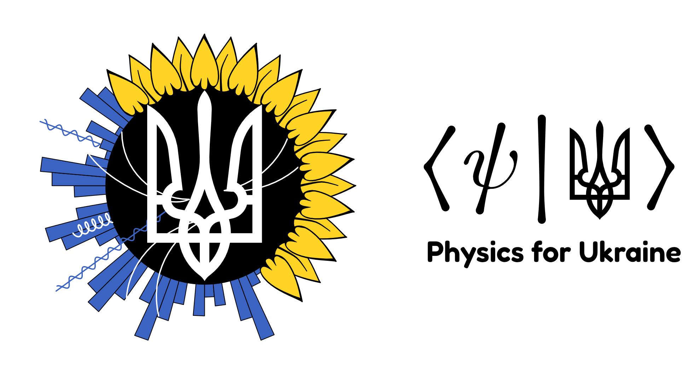

In 2022 a group of physicists launched an effort to create a space to support refugee physicists from the [February 2022 invasion of Ukraine](https://en.wikipedia.org/wiki/2022_Russian_invasion_of_Ukraine). I was asked to think about a logo for the group and came up with the following.

The group put in a tremendous amount of work. Ultimately the effort was absorbed into the auspices of the National Academies of Science ([APS press release](https://aps.org/programs/international/ukraine.cfm)) and the logo was no longer needed. [Read more here](https://twitter.com/physics_nate/status/1504905331603738624); article in [*Science* about the impact on scientists](https://www.science.org/content/article/ukraine-s-mounting-death-toll-includes-growing-number-researchers).

The design for the logo encloses the Ukrainian coat of arms in a combined sunflower/collider logo. I repurposed earlier work on the Snowmass logo for the collider side. One weakness of the design is that the iconography of particle physics is used to represent all of physics. 

The Ukrainian coat of arms is stylistically reminiscent of the letter $\psi$. The secondary logo of a bra and a ket represents the overlap of physics (represented by the $\langle\psi|$) with Ukraine (represented by the trident in a ket). The secondary logo is more of a visual pun but works as a monochromatic representation of the effort.