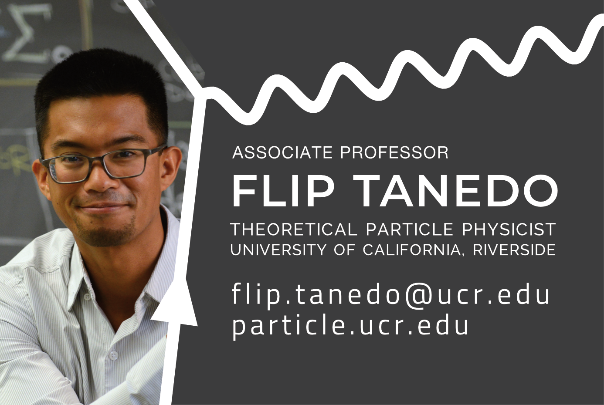
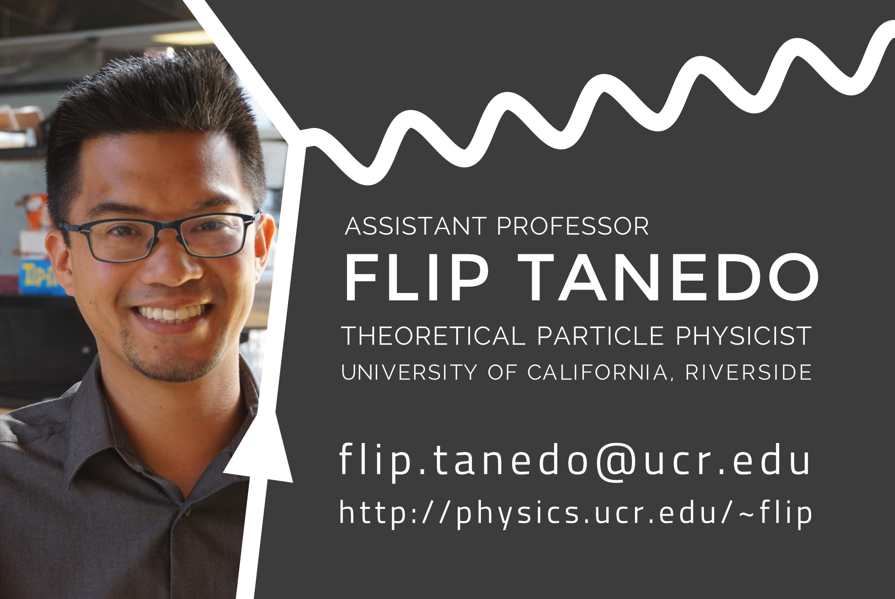
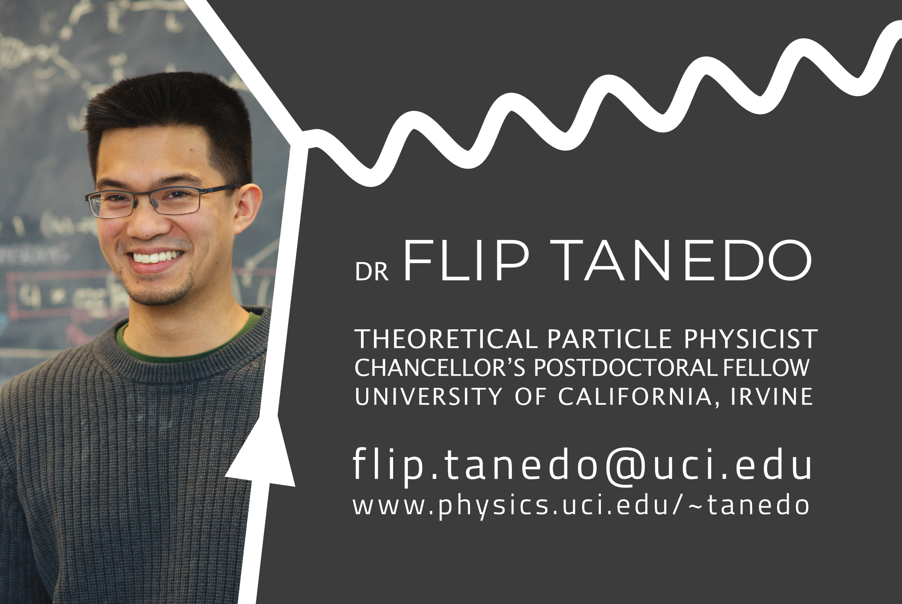

I have a formative memory of meeting Prof. Aomawa Shields at a UC PPFP conference and being blown away by her business card. It spoke to making a good first impression and presenting yourself as a professional. At the time the two of us were postdocs looking early in our search for faculty positions.

I created these cards in [Affinity Designer](http://affinity.serif.com) and printed them using [Moo.com](https://www.moo.com/us/). Moo has a helpful Adobe Illustrator template for making sure all the elements of the design are sufficiently centered. In my later iterations I splurged on having a glossy finish over the Feynman diagram while leaving the rest of my card matte on a heavy cardstock.

## 2022

I was excited to update my 2022 card with my recently tenured title.

## 2017

## 2014

