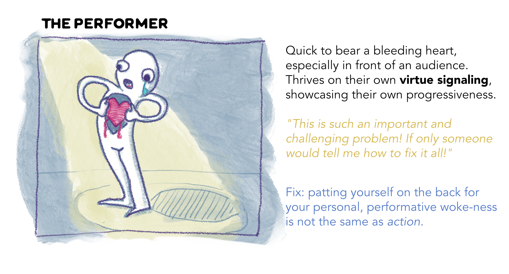
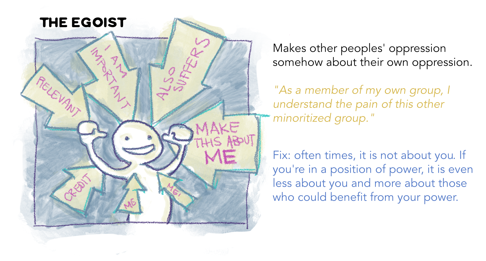
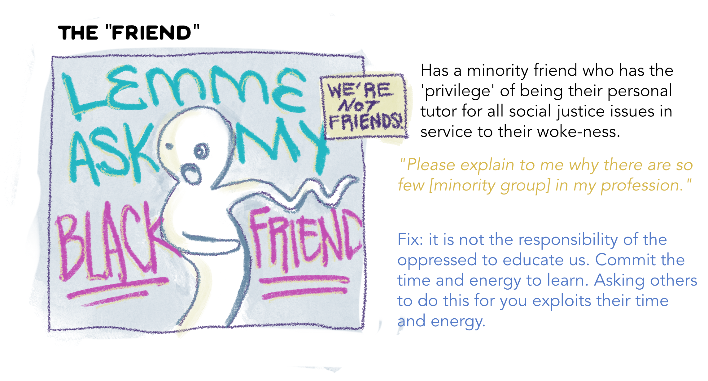
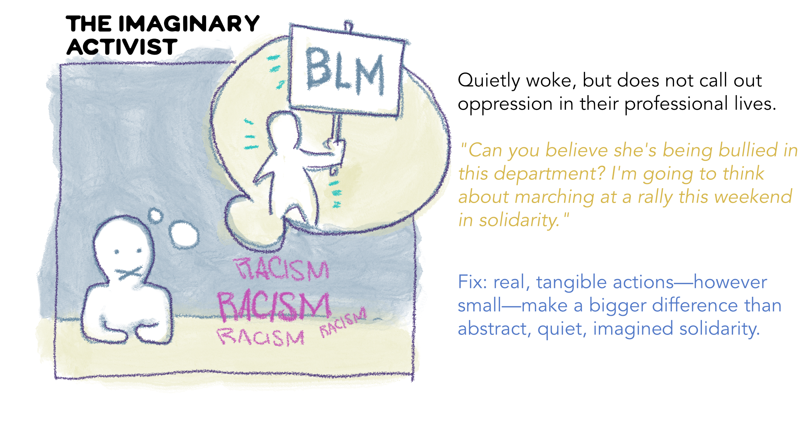

The June 2020 [Strike for Black Lives](https://en.wikipedia.org/wiki/Strike_for_Black_Lives_(academic_protest)) was a call for social justice within academia. During the discussions at my home department and reflecting on some of the ongoing barriers to meaningful equity and inclusion I found myself sketching some of the ways in which we, as academics, can fail in our attempts to create real positive change. I sketched them out as small one-panel comics with my own personal commentary.

There are plenty of "failed allies" in other academic endeavors that manage to succeed. Since this time I have spent more time reflecting on the community-level systems that form barriers to meaningful equity efforts. 