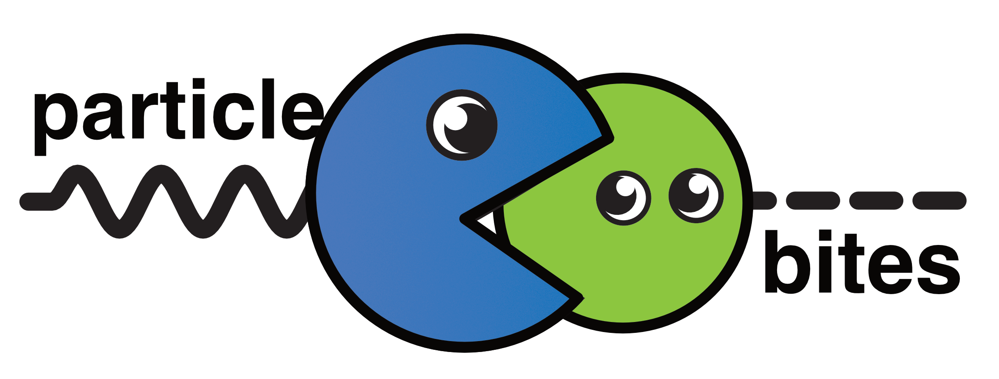

[ParticleBites](https://www.particlebites.com) is an outreach blog I started in 2013 after attending the first ComSciCon workshop. It grew out of my early blogging efforts with US/LHC and later Quantum Diaries and is now hosted by the AAS.

The ParticleBites logo is based on one of my US/LHC blog posts about the Higgs and Goldstone bosons. The blue particle is a massive gauge boson that is 'eating' the green Goldstone mode of a Higgs particle.

The two circles are an easy combination for a square icon. Attaching wiggly line for the gauge boson and dashed line for the Higgs makes the logo wider and appropriate for a banner.