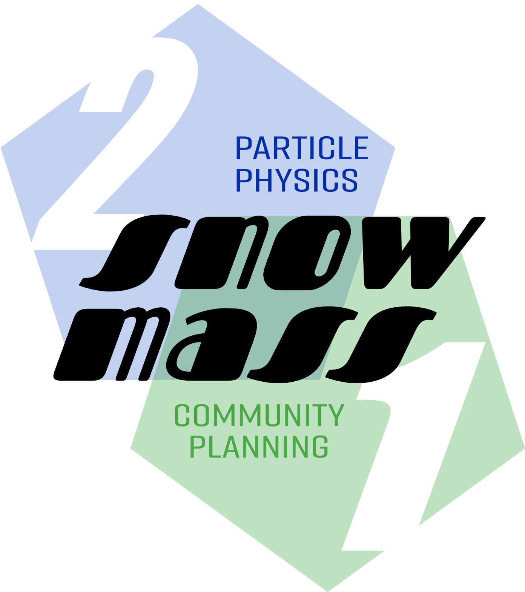
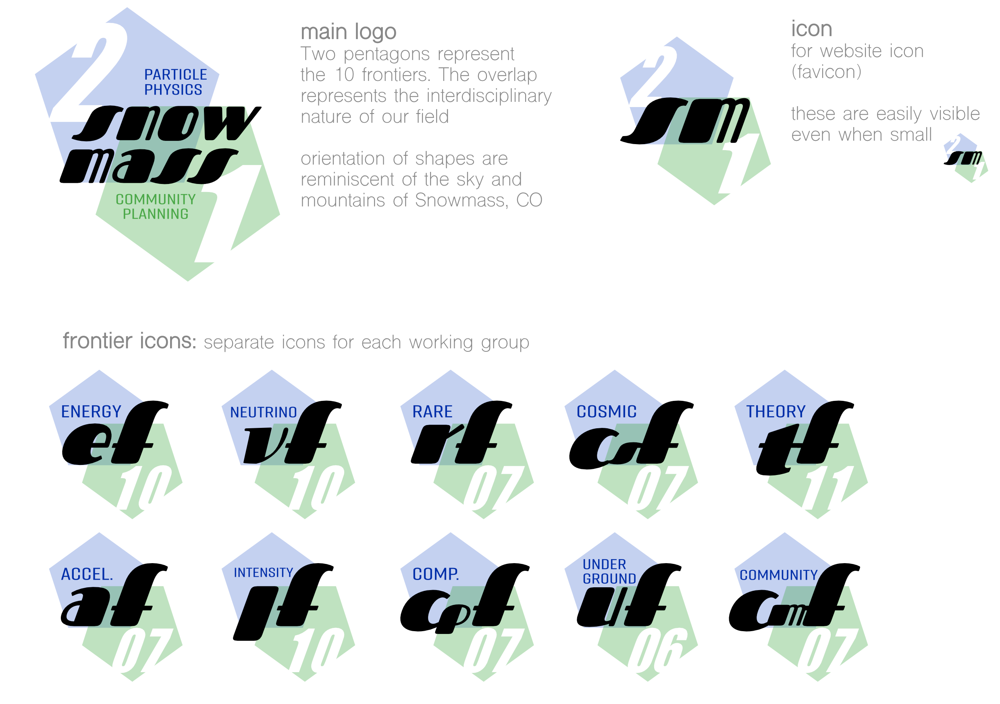
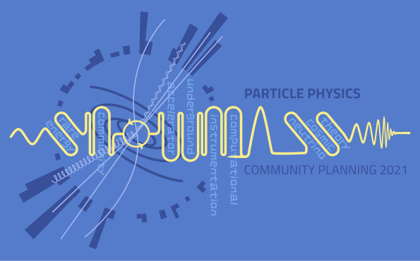
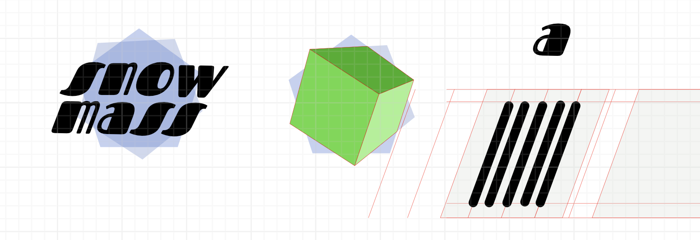
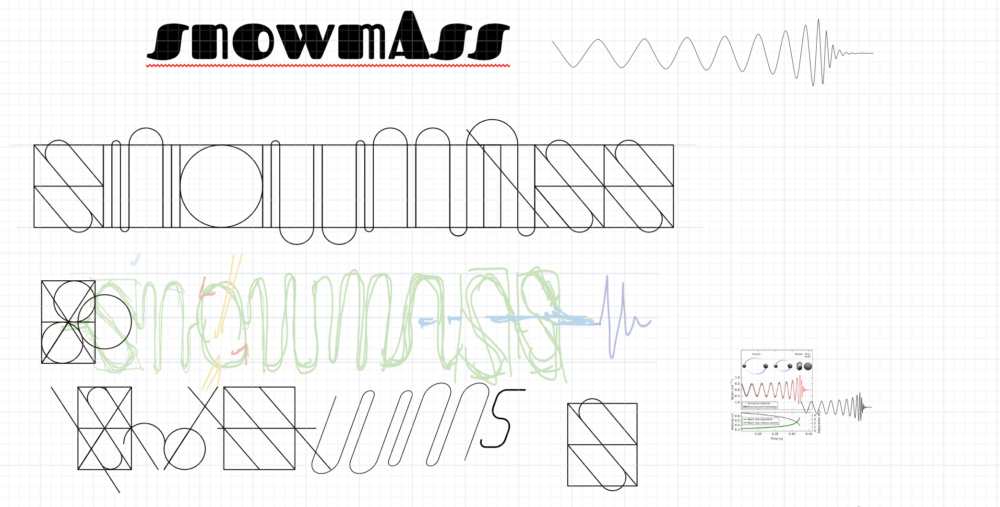
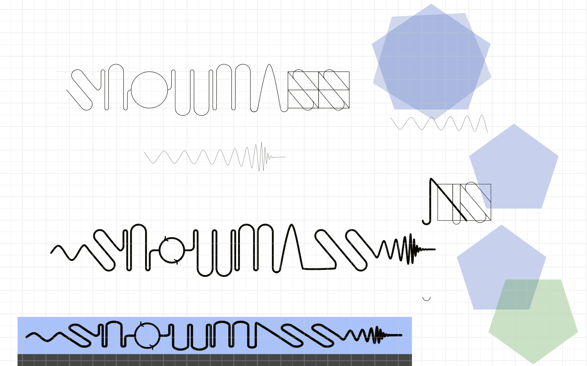
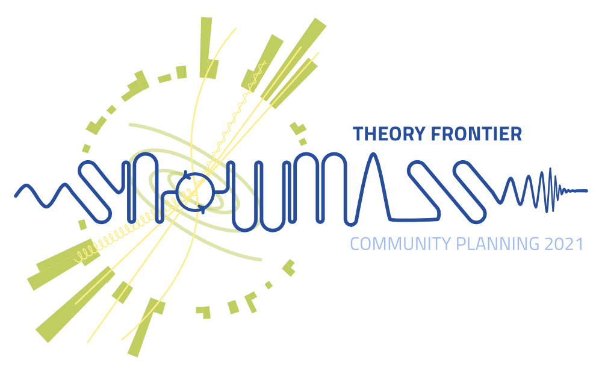
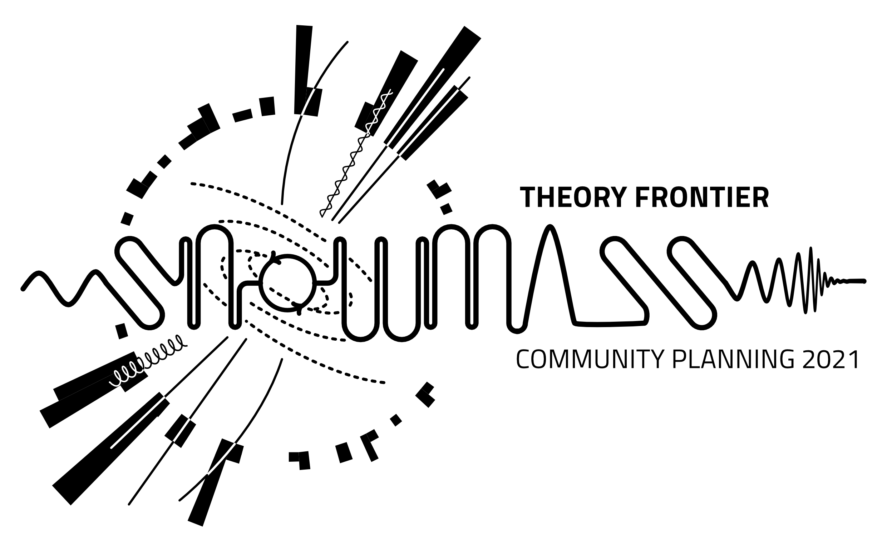
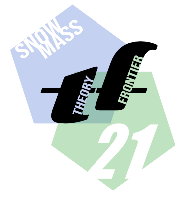

The [2021 Snowmass Community Planning Exercise](https://snowmass21.org) is a year-long, decadal study to craft a scientific vision for the future of high-energy physics in the US. It is organized by the American Physical Society's Division of Particles and Fields. In 2021 the DPF hosted a logo contest for that year's effort. 

I present my two entries for the logo contest here. 

## Pentagons

The Snowmass icon is based on two pentagons. The two pentagons reflect the ten scientific frontiers in the Snowmass process. It was important to me stylistically to represent interdisciplinary overlap, though stylistically I do not feel that I made the most of the overlapping region. The colors represent the sky and mountains of Snowmass, Colorado, where the original Snowmass study took place.

I presented the following image for the proposed usage:

The vision for the logo is that it could be rescaled to smaller icons, replacing "snowmass" with "sm." This was a pun for the Standard Model. The numbers "21" indicate the 2021 iteration of Snowmass, but also introduce the idea that each logo comes with two numbers.

The proposed usage for the icon is that each of the ten frontiers would have their own related icon. These frontiers are further subdivided into enumerated working groups. The elements of the logo naturally rearrange themselves into logos for each frontier's working group.

## Slope

A second proposal for the Snowmass logo is inspired by the ski slopes at Snowmass. I had recently visited Snowmass in the late summer of 2021 (visiting the Aspen Center for Physics) as part of my first travel since the COVID-19 lockdown. The ski slopes are converted into hiking and mountain bike trails. From the ski lift, one sees these winding trails on the slope that inpsired the yellow 'snowmass' text in logo.

I wanted to play with the visual cadence of the curved letters as seen in the 'n', 'w', and 'm'. The 's' became a tilted version of this, but it made scaling the text difficult. I incorporated the details of a Feynman diagram: the leading wiggly line on the left is a photon propagator, and the 'o' is a loop diagram with virtual fermions. On the right-hand side rather than returning to the photon propagator, I inserted the [GW150914](https://en.wikipedia.org/wiki/First_observation_of_gravitational_waves) gravitational waveform to represent the exciting role of cosmology in fundamental physics in the coming decade.

The background is a stylized particle detector with a stylized Milky Way galaxy at its center, which coincides with the location of the 'o' in the main text. A small visual pun are the 'jets' from the Milky Way replaced with particles which may form jets in a collider. Among the Feynman diagram lines is an overlapping wiggly line + straight line that represents a gaugino. The ten frontiers are written in the nooks of the main text.

Unlike the pentagons logo, the slope logo is a little busy. I imagined elements being removed selectively as needed. For example, one could use only the 'snowmass' text as a one line monochromatic logo. Alternatively, one could remove all text and stylized text and leave the Milky Way + detector background. One challenge is that the 'snowmass' text is not easy to read. On the other hand, the purpose of a logo is not to be read but to be recognized.

## Design notes

My early sketches played with the ideas of (1) a recognizable font and (2) a geometric unification of the 10 frontiers. These ended up separately in the pentagons and the slope logos.

I was really excited about the idea of a three-dimensional cube fitting into the ten pointed polygon. I thought it was a visual way to show that the different frontiers were different facets of fundamental physics. This did not work out in any final design and I ended up abandoning it.

I liked the idea of the 'a' in 'snowmass' representing a mountain peak. I quickly gave up on this after it seemed like a crude pun on the title. I played a bit with wiggly lines and slopes. The wiggles quickly led to the idea of attaching the gravitational waveform.

The wiggly lines turned into their own logo, while the decagon turned intwo two overlapping pentagons. 

## Repurposing for the Theory Frontier

My logos were later repurposed and adopted by the Theory Frontier. 

We made a black-and-white version in case we wanted to create etched swag.

The pentagons were also repurposed:

I have since had a delightful conversation with Jesse Thaler who independently had incorporated pentagons in the iconography of P5. The 2013 Snowmass process and subsequent Particle Physics Prioritization Panel (P5) report used a swirling logo that represented the five frontiers of Snowmass 2013. One arguable omission is a theoretical frontier---this led to the existence of a theory frontier in Snowmass 2021. Jesse gave a talk at the [Snowmass 2021 Community Planning Meeting](https://indico.fnal.gov/event/22303/contributions/245297/attachments/157785/206608/jthaler_2022_07_Snowmass_Pheno.pdf) that inserted a pentagon in the space of the P5 logo to represent the role of theory:

A bit more about Snowmass from the theory frontier perspective:
<iframe src="//www.slideshare.net/slideshow/embed_code/key/cJmqYUgJ9WwEwx" width="595" height="485" frameborder="0" marginwidth="0" marginheight="0" scrolling="no" style="border:1px solid #CCC; border-width:1px; margin-bottom:5px; max-width: 100%;" allowfullscreen> </iframe>