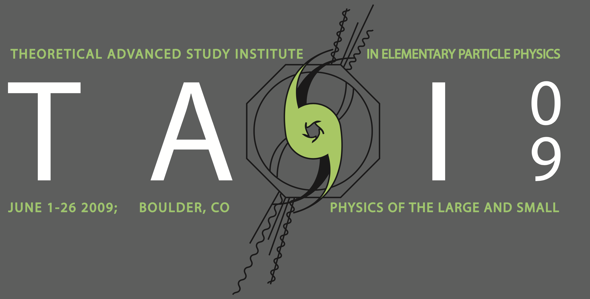
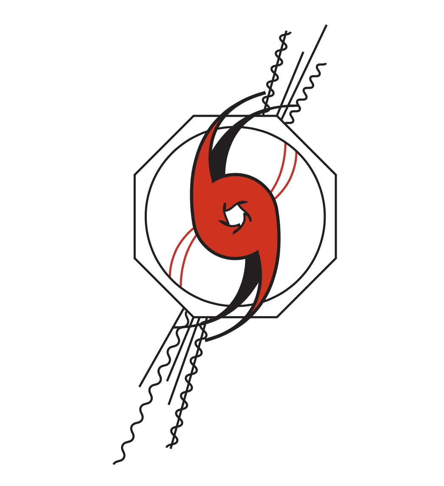

The Theoretical Advanced Studies Institute is a summer school for theoretical particle physicists. One of the traditions of the school is for the students to design a t-shirt. You end up seeing these t-shirts worn by grad students and postdocs for years to come. Every once in a while one of the lecturers wears their old TASI shirt.

My TASI 09 t-shirt was printed on a variety of shirt colors: gray, beige, baby blue, and pink. The logo represents a spiral galaxy overlaid on an LHC detector. I thought it was a good representation of the theme of the school, the physics of the large and small. It is a motif that I would re-use for my proposed [Snowmass 2021 logo](../snowmass/).

I even re-used it as an unofficial logo for the Cornell particle theory group:

