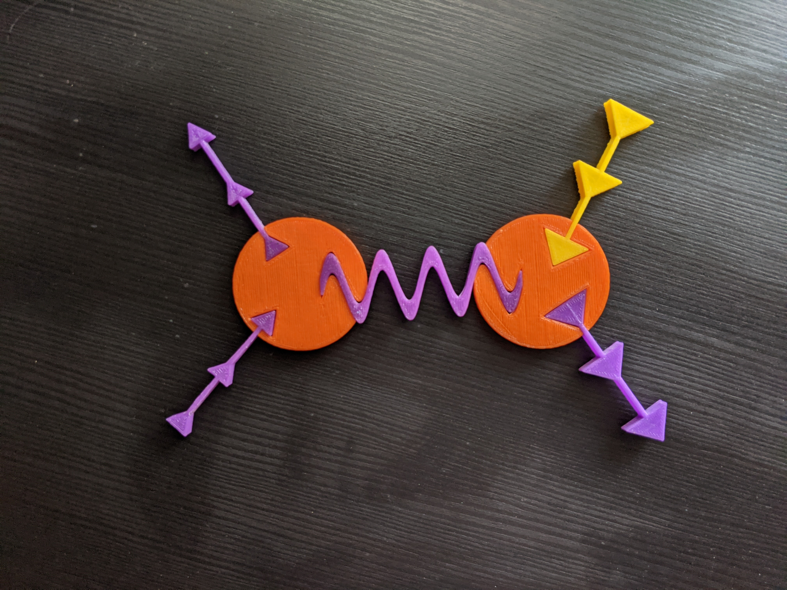

Tinker Feynman is a [Science Hack Day: San Francisco (2017)](http://sf.sciencehackday.org/hacks-2017/) hack in collaboration with Prof. Matt Bellis and Siena College undergraduate Maddy Hagen. Matt and Maddy 3D printed our hack and sent me a copy:

Our slide deck is [available here](https://docs.google.com/presentation/d/e/2PACX-1vQZht_mQ9H8IQZLgXeuz13IqVbvvav7X_8ot8MOGC4g7A8IlH89Q8CMzLAhl9Sqt4_q6rzLjwzn9nxD/pub?start=false&loop=false&delayms=3000&slide=id.p), the project STL files are available on [Matt's GitHub page](https://github.com/mattbellis/tinkertoy-feynman).

The idea of 'snap-together' Feynman diagrams came out of the Feynman diagram series of blog posts I wrote for the US/LHC blog in the late 2000s. I had been rethinking those blog posts with respect to a diagrammatic approach to teaching particle physics to undergraduates. I continue to think about ways in which the Tinker-toy approach can be generalized to the full Standard Model, perhaps by using hex tiles. 

* ["Hackathons catch on for creativity, education, and networking"](https://physicstoday.scitation.org/doi/10.1063/PT.3.4746), Toni Feder, *Physics Today* 74, 5, 23 (2021)